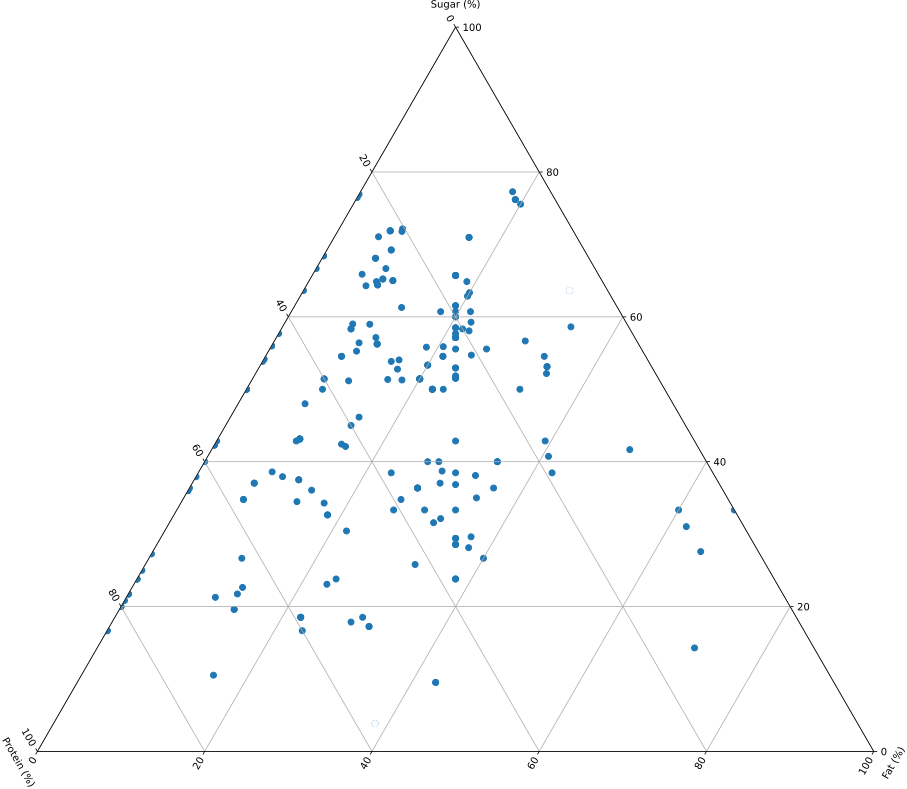

# Profiles of the Many Dramatically Different Yogurts at Whole Foods
link to story: [on yogurts!](https://jellomoat.github.io/yogurts/)

## Description and Objectives
This project is a semi-visual exploration of yogurts (at Whole Foods) and their nutritional value.

## Overall Findings

## Data Collection Process

#### Working with the [USDA FoodData Central Dataset](https://fdc.nal.usda.gov/download-datasets.html)
At the start of this project I did a deep dive into USDA FoodData Central's dataset of all branded foods in the United States.  I was excited to work with such a rich dataset, containing thousands of products and all the nutritional info related to them.  A search for "yogurt" alone yielded over 23K results using their Food Search widget.  Unfortunately, there was no simple way to export data filtered in the widget, so I opted to download the [entire dataset](https://fdc.nal.usda.gov/download-datasets.html) instead and parse it with pandas and Jupyter.

While the exported data was as featureful as I had hoped, I quickly discovered that it came in a disaggregated format across many files, each containing a single table from what appeared to be a complex relational database.  Thankfully, the table schemas were well-documented so after many hours grappling with the data, I was able to produce a dataframe that could display the product name, brand, ingredients, and nutritional composition in a simple tabular format.

#### Extracting Whole Foods Data

Once data prep was done, I decided to focus on products available for purchase in stores, beginning with the 232 yogurt products displayed on the [Whole Foods yogurt page](https://www.wholefoodsmarket.com/products/dairy-eggs/yogurt).  As Whole Foods does not provide a publicly accessible API, I used ScraPy to crawl through the yogurts page and extract links to each individual yogurt product.  This proved to be more challenging than I anticipated, as the products dynamically load through user interaction.  I tried all the documented strategies I could find for getting around this, such as [those detailed in ScraPy's docs](https://docs.scrapy.org/en/latest/topics/dynamic-content.html), to little avail.

I then realized I could load up the page in its entirety myself, then "print" the page as a text file or PDF, then scrape from the resulting file.  That was kind of janky but actually worked. 🤷‍♀️

So, I initially just wanted a list of products I could reference in combination with the USDA dataframe I had already prepared.  Sadly, I realized at that point that it could be unduly challenging to write regex that could match Whole Foods products with those listed in the USDA dataset, since there could be slight variations in how they're formatted between their names on record with the USDA and their public-facing product names.

Since I already had a ScraPy crawler set up, I decided to use it to crawl through the list of links instead.  And that worked.  With that and some pandas magic, a nice dataframe appeared.

## Data Analysis Process

From there I used pandas to further query the dataframe.  I used matplotlib and mpltern to create a ternary plot of sugar, fat, and protein content for all yogurts.  After careful consideration of this plot, I noticed, as expected, that the nutritional profiles of yogurts vary wildly.

I used that first plot as a starting point for segmenting the dataframe, creating subsets and plots for specific yogurt categories once they revealed themselves.

## Tools and Techniques Used
- Web scraping using [ScraPy](https://scrapy.org/)!
- Using scrappy strategies to extract data from pages that have [dynamically loaded content](https://docs.scrapy.org/en/latest/topics/dynamic-content.html)!
- Lots of [pandas](https://pandas.pydata.org/) everywhere for ETL, joining tables, etc.
- Plotting data using [Datawrapper](https://www.datawrapper.de/), [Matplotlib](https://matplotlib.org/stable/index.html), [mpltern](https://mpltern.readthedocs.io/en/latest/), and [Jupyter](https://jupyter.org/)

## Things I Planned On Doing But Did Not Get To Yet:
- Add more images of yogurts discussed
- Incorporate icons on plots for reference foods (eg an Oreo image could replace what is presently a red dot)
- Analyze and plot/chart ingredients and probiotic cultures incl kefir
- Create image maps using WF store aisle photos, with an overlay of classifying colors (cyan, magenta, yellow)
- Make ternary plots interactive with d3!
